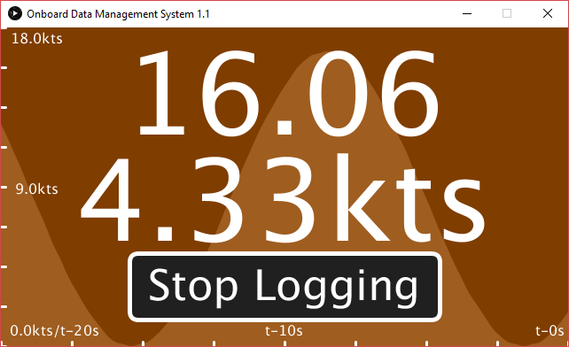

# Onboard-Data-Management-System
A mini project created during my internship at UCLA to intercept, analyze, and log digital speed data signals from a boat paddlewheel sensor.

  

## Getting Started
These instructions will help you get a copy of the project up and running.

### Prerequisites
You'll need the following before getting started:
<ul>
  <li>An Arduino board</li>
  <li>Java Development Kit</li>
</ul>

### Installation
Upload either sinewave.ino or datarelay.ino to an Arduino board and connect it via serial to the computer. To upload, use the Arduino IDE, which can be found <a href="https://www.arduino.cc/en/Main/Software">here</a>.

Use sinewave.ino for testing ODMS or datarelay.ino for live data logging. sinewave.ino continuously generates flips in a sine wave pattern. datarelay.ino counts and transmits data received from the paddlewheel sensor when connected.

By default, datarelay.ino has digital pin 3 configured for data input. If you are going to use a different pin, be sure to change the value of the #define at the top of the file.

After your Arduino is fully set up, simply plug it in, compile and run ODMS to get the on-screen display and you're good to go!

## Authors
<ul>
  <li>Ryan Zhu</li>
</ul>

## Support
If you have any questions, feel free to email me at <a href="mailto:ryanzhu2018@gmail.com">ryanzhu2018@gmail.com</a>
